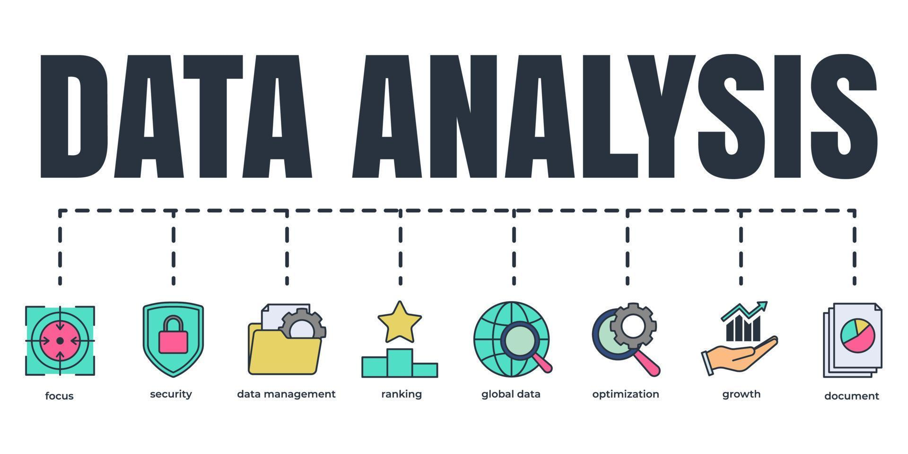

# Linguagem de Programação 5

Repositório para estudo da disciplina do 5º período do curso de ADS da Faculdade FBR.

## Ferramentas usadas

- [Visual studio code](https://code.visualstudio.com/download)
    - ### Extensões
    - [Markdonw git hub preview](https://marketplace.visualstudio.com/items?itemName=PKief.material-icon-theme)
    - [Mardown Checkbox](https://marketplace.visualstudio.com/items?itemName=bierner.markdown-checkbox)

- [Git](https://git-scm.com/)

